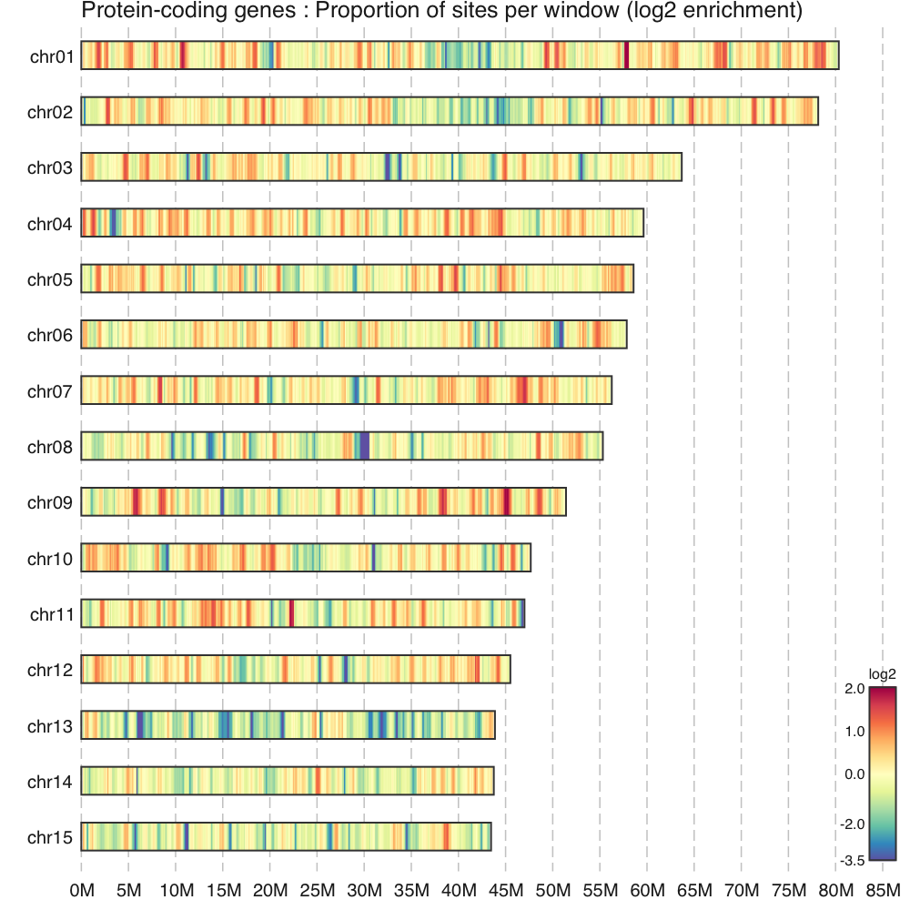

# Plot heatmaps of genome-wide stats

Plots heatmaps of the density of specified genomic elements along the chromosomes.

## Binning the elements in genomic windows

Before making the plots, we need to make a tally of the genomic elements of 
interest (e.g., genes, exons, repeats, etc.) along the genome. This script slices 
the genome down into windows of even lengths, which can be either overlapping or 
non-overlapping, and tallies both the number of the target element in each window, 
as well as the proportion of total basepairs covered by those elements. These are 
then used as inputs for the plotting script.

### Usage

```sh
$ python3 bin_genome_stats.py -h

  bin_genome_stats.py started on 2025-03-26 13:43:54.
  usage: bin_genome_stats.py [-h] -f FAI -b IN_BED [-n BASENAME] [-o OUT_DIR] 
                             [-s WIN_SIZE] [-t WIN_STEP] [-m MIN_LEN] [-p MIN_SPAN]
  
  options:
    -h, --help            show this help message and exit
    -f, --fai FAI         (str) Path to genome index in FAI format.
    -b, --in-bed IN_BED   (str) Path to input BED file describing the windows to be 
                          tallied.
    -n, --basename BASENAME
                          (str) Basename of output files [default=BED Basename].
    -o, --out-dir OUT_DIR
                          (str) Path to output directory [default=.].
    -s, --win-size WIN_SIZE
                          (int/float) Size of windows in bp [default 100,000].
    -t, --win-step WIN_STEP
                          (int/float) Step of windows in bp [default 50,000].
    -m, --min-len MIN_LEN
                          (int/float) Minimum chromosome size in bp [default 
                          1,000,000]
    -p, --min-span MIN_SPAN
                          (int/float) Minimum genomic span in bp required to keep an 
                          element from the input BED file [default=1].
```

### Inputs

Genome FASTA index, as generated by `samtools faidx <genome.fa>` 
([docs](http://www.htslib.org/doc/samtools-faidx.html)).

```sh
chr01   80341233   7           60   61
chr02   78161376   81680268    60   61
chr03   63686915   161144341   60   61
chr04   59637274   225892712   60   61
chr05   58573614   286523948   60   61
chr06   57852047   346073796   60   61
chr07   56263885   404890051   60   61
chr08   55317060   462091675   60   61
chr09   51410974   518330693   60   61
chr10   47667791   570598524   60   61
```

The span of the regions of interest in BED 
[format](https://genome.ucsc.edu/FAQ/FAQformat.html).

```
chr01   53102   53391
chr01   60254   60418
chr01   63590   63767
chr01   70591   70702
chr01   73652   73765
chr01   74530   74924
chr01   87523   87679
chr01   88104   88308
chr01   95152   95296
chr01   95709   95866
```

Note that only the first three columns are required (`chrom`, `chromStart`, and `chromEnd`), 
following the BED specification. The additional columns can contain additional information, 
but they are not used by the software. If the objective is to generate the window statistics 
for different genetic elements (e.g., genes vs repeat elements), the software must be run 
separately.

For example, a BED file of the location of annotated coding sequences (CDS) can be 
extracted from a GFF/GTF file using the following command. Note that GFF/GTF coordinates 
are 1-based, so 1 is subtracted from the start coordinate to convert to the 0-based BED 
format.

```sh
$ cat genome.gff | \
    awk '$3 == "CDS" {print $1, $4-1, $5}' | \
    tr ' ' '\t' > genome.cds.bed
```

If the annotation contains more than one transcript per gene, the CDS of the alternative 
isoforms can overlap or be repeated. Repeated intervals will be counted multiple times 
in the number of elements per window (sites are counted once in the proportion of sites; 
see below), so you may want to remove them, e.g., using `sort -u`.

### Example

```sh
python3 bin_genome_stats.py \
    --fai ./genome.fa.fai \       # Path to genome FAI
    --in-bed ./genome.cds.bed \   # Path to input BED
    --basename genome_cds \       # Basename of output files
    --out-dir ./output \          # Path to output directory
    --min-len 1000000 \           # Calculate for scaffolds larger than 1 Mbp
    --win-size 500000 \           # Average over 500 Kbp windows
    --win-step 100000 \           # Calculate windows every 100 Kbp
    --min-span 10                 # Include only input elements larger than 10 bp
```

Here, we will calculate the windowed average of the density of the coding sequences of 
annotated protein-coding genes in a target genome. We used the BED file generated above to 
specify the location of these coding sequences using the `--in-bed` option. We specify the 
size and number of chromosomes by providing a genome index in FAI format (`--fai`).
We want our output files to be saved to 
a specific directory (`--out-dir`), using a provided basename (`--basename`) to name the 
generated files.

We also provide other option describing the length and distribution of the windows. First,
we want to calculate results only for input sequences larger than 1 Mbp (`--min-len`). The 
windows will be 500 Kbp in length (`--win-size`), and we will calculate windows every 100 
Kbp (`--win-step`). Since the step of the windows is smaller than the window size, adjacent 
windows will have some amount of overlaping sites. Setting the step of windows equal to 
their size will result in non-overlapping windows. Lastly, we will filter the input BED,
skipping over any input intervals smaller than 10 bp (`--min-span`).

### Output

After running with the example above, the script will generate an output labelled 
`genome_cds.binned_genome_stats.tsv` with the following structure:

```sh
#Chrom  StartBP  EndBP    MidBP    ElementsN  ElementsAdj  PropSites  PropSitesAdj
chr01   0        500000   250000   114        1.1873593    0.04239    0.58222776
chr01   100000   600000   350000   104        1.0561147    0.03852    0.44411834
chr01   200000   700000   450000   83         0.73418664   0.031384   0.14855691
chr01   300000   800000   550000   68         0.45039368   0.023514   -0.26792159
chr01   400000   900000   650000   57         0.19985022   0.02291    -0.30546087
chr01   500000   1000000  750000   82         0.71690865   0.036598   0.37027938
chr01   600000   1100000  850000   85         0.76813398   0.037266   0.39637313
chr01   700000   1200000  950000   87         0.80130084   0.038436   0.440969
chr01   800000   1300000  1050000  90         0.84966386   0.04284    0.59746156
```

Info on columns:

| Column Header   | Explanation |
| --------------- | ----------- |
| `Chrom`         | Name of the chromosome/scaffold sequence. |
| `StartBP`       | Start coordinate of the window in basepairs. |
| `EndBP`         | End coordinate of the window in basepairs. |
| `MidBP`         | Midpoint coordinate of the window in basepairs. |
| `ElementsN`     | Number of elements seen in the window. |
| `ElementsAdj`<sup>1</sup> | Log2 enrichment of the number of elements in the window, relative to the genome-wide average. |
| `PropSites`<sup>2</sup> | Proportion of sites in the window corresponding to the target elements. Sites belonging to overlapping elements are counted once. |
| `PropSitesAdj`<sup>1</sup> | Log2 enrichment of the proportion of sites in the window corresponding to the target elements, relative to the genome-wide average. |

<sup>1</sup>For standardization purposes, the adjusted values 
correspond to the log2 enrichment of the window relative to the genome-wide mean, 
i.e., `log2(window_value/genome_mean)`. Values greater than 0 describe windows with 
higher than average values, while values smaller than 0 describe windows with smaller 
than average values. For example, a `ElementsAdj` of 1 indicates that the given 
window contains twice as many elements as the genome-wide average, while a value of 
-1 indicates half as many. To handle windows without any elements, a pseudocount of 
one element (`ElementsAdj`) or one site (`PropSitesAdj`, i.e., `1/window_length`) 
is added to both the window value and the genome-wide mean.

<sup>2</sup>The `PropSites` column describes the proportion of sites in a window 
corresponding to the elements of interest. In other words, if in the span of a 
100 Kbp window, 30 Kbp of those sites are in the span of an element of interest 
(e.g., genes), then the window will have a `PropSites` value of 0.3. Similar to 
`ElementsAdj`, this value is then reported as a log2 enrichment over the genome-wide 
average in `PropSitesAdj`.

### Dependencies

* Python > 3.10
* [NumPy](https://numpy.org/)

## Making the plots

With the average of the number and proportion of total elements calculated along 
windows in the genome, we can proceed with plotting them as a heatmap. The resulting 
plot shows the density of the elements of interest along the genome.

### Usage

```sh
$ python3 cairo_plot_genome_stats.py -h

  cairo_plot_genome_stats.py started on 2025-03-27 14:53:21.
  usage: cairo_plot_genome_stats.py [-h] -f FAI -t IN_TABLE [-c CHROMS]
                                    [-o OUT_DIR] [-n BASENAME] [--title TITLE]
                                    [-m MIN_LEN]
                                    [-s SCALE] [-p STEP]
                                    [--img-height IMG_HEIGHT]
                                    [--img-width IMG_WIDTH]
                                    [--img-format IMG_FORMAT]
                                    [--max-log2 MAX_LOG2] [--min-log2 MIN_LOG2]
                                    [--palette PALETTE] [--reverse-palette]
                                    [--scale-quantile SCALE_QUANTILE]

  options:
    -h, --help            show this help message and exit
    -f, --fai FAI         (str) Path to genome index in FAI format.
    -t, --in-table IN_TABLE
                          (str) Path to input table of window statistics,
                          generated by `bin_genome_stats.py`.
    -c, --chroms CHROMS   (str) Path to chromosome order list [default=None].
    -o, --out-dir OUT_DIR
                          (str) Path to output directory [default=.].
    -n, --basename BASENAME
                          (str) Basename of output files [default=In table
                          basename].
    --title TITLE         (str) Title of the plots, followed by the type of
                          plot [default=Basename].
    -m, --min-len MIN_LEN
                          (int/float) Minimum chromosome size in bp [default
                          1,000,000]
    -s, --scale SCALE     (int/float) Scale chromosome lengths to this value
                          [default=1,000,000],
    -p, --step STEP       (int/float) Steps for size for axis tick marks
                          [default=5,000,000].
    --img-height IMG_HEIGHT
                          (int) Image height in pixels [default=500].
    --img-width IMG_WIDTH
                          (int) Image width in pixels [default=500].
    --img-format IMG_FORMAT
                          (str) Image output format [default=pdf]
    --max-log2 MAX_LOG2   (int/float/'auto') Upper limit of the log2 enrichment
                          color scale; values above this are clamped. If 'auto',
                          set the limit for each plot from the data (see
                          --scale-quantile) [default=3].
    --min-log2 MIN_LOG2   (int/float/'auto') Lower limit of the log2 enrichment
                          color scale (a negative value); values below this are
                          clamped. If 'auto', set the limit for each plot from
                          the data (see --scale-quantile). If not set, the scale
                          is symmetric, i.e., -1 * --max-log2 [default=None].
    --palette PALETTE     (str) Diverging color palette for the heatmaps, from
                          depleted to enriched values [default=RedYellowBlue].
    --reverse-palette     (flag) Reverse the order of the color palette.
    --scale-quantile SCALE_QUANTILE
                          (int/float) Percentile used to set 'auto' limits of
                          the color scale, rounded away from 0 to the nearest
                          0.5 [default=99].
```

### Inputs

Genome FASTA index (see example above). This specifies the length and 
ID of the sequences to be plotted. Sequences below a certain length 
threshold can be filtered using the `--min-len` option.

A `*.binned_genome_stats.tsv` table, generated by the `bin_genome_stats.py` 
script (see example above).

Optionally, a chromosome order file can be provided. This file specifies the 
order in which the chromosomes are plotted, if different from the FAI. The file 
contains the chromosome IDs (one per line) in the order they will be plotted 
(first sequence in the file will be plotted at the top).

```sh
chr01
chr02
chr03
chr06
chr04
chr08
...
```

### Example

```sh
python3 cairo_plot_genome_stats.py \
    --fai ./genome.fa.fai \                                  # Path to genome FAI
    --in-table ./output/genome_cds.binned_genome_stats.tsv \ # Path to input table
    --basename genome_cds \                                  # Basename of output files
    --title "Protein-coding genes" \                         # Title of the plots
    --out-dir ./output \                                     # Path to output directory
    --min-len 1000000 \                                      # Plot scaffolds larger than 1 Mbp
    --step 5000000 \                                         # Use a 5 Mbp step for the axis tick marks
    --chroms ./chrom_list.txt \                              # Path to the chromosome list file
    --palette Spectral \                                     # Color palette
    --min-log2 auto \                                        # Set the lower limit of the color scale from the data
    --max-log2 2                                             # Set the upper limit of the color scale to a log2 of 2
```

Here, we make a heatmap of the density of protein-coding genes (their coding sequences) 
in the target genome, based on the distribution provided by the 
`genome_cds.binned_genome_stats.tsv` file (`--in-table`). We specify the size and number of 
chromosomes by providing a genome 
index in FAI format (`--fai`). We also provide a file describing a specific order for 
plotting the chromosomes (`--chroms`). We want our output files to be saved to 
a specific directory (`--out-dir`), using a provided basename (`--basename`) to name 
the two output plots. Lastly, we specify that we only want to plot sequences larger than 
1 Mbp (`--min-len`), and using a 5 Mbp step for the axis tick marks (`--step`). 
The plots are titled "Protein-coding genes" (`--title`) and colored using the ColorBrewer 
`Spectral` palette (`--palette`). The lower limit of the color scale is set from the data 
(`--min-log2 auto`, i.e., the 1st percentile of the log2 enrichment values, rounded down 
to the nearest 0.5), while the upper limit is set to a log2 enrichment of 2, i.e., 4-fold 
enrichment (`--max-log2 2`). See below for more details on the color scale.

### Outputs

The script generates two plots:

| Plot | Description |
| ---- | ----------- |
| `<basename>.num_elements.pdf` | Plot of the number of elements in each window, as specified by the `ElementsAdj` column in the input table. |
| `<basename>.site_proportions.pdf` | Plot of the proportion of target bases in each window, as specified by the `PropSitesAdj` in the input table. |

Both plots use a diverging color scale centered at 0, i.e., the genome-wide average. 
Windows in blue (by default, but color depends on the palette used) 
have lower than average values (log2 enrichment < 0), and windows in 
red (again, by default but depends on the palette) have higher than 
average values (log2 enrichment > 0). The scale is symmetric, 
ranging from `-MAX_LOG2` to `MAX_LOG2` (set with `--max-log2`), and values outside 
this range are colored as the limits of the scale. The number of clamped 
windows is reported in the log.

The colors are set with `--palette`. Available palettes are the original 3-color 
palettes (`RedYellowBlue`, the default; `BlueWhiteRed`; `ViridisClassic`; `Mango`; 
`MangoLight`; and `MagmaClassic`), the 11-class diverging palettes from 
[ColorBrewer](https://colorbrewer2.org) (`RdYlGn`, `RdYlBu`, `RdBu`, `RdGy`, `PuOr`, 
`BrBG`, `PiYG`, `PRGn`, and `Spectral`), and the viridis color maps 
([viridisLite](https://sjmgarnier.github.io/viridisLite/); `viridis`, `magma`, `inferno`, 
`plasma`, `cividis`, `rocket`, `mako`, and `turbo`). Note that the viridis color maps are 
sequential rather than diverging, so the color marking the genome-wide average (a log2 
of 0) is not a neutral color. 
The ColorBrewer palettes are oriented so that the first color in their name marks the 
enriched values, e.g., red in `RdYlGn` for windows with higher than average values. 
The order of any palette can be flipped using `--reverse-palette`.

Alternatively, the limit of the scale can be set from the data using `--max-log2 auto`. 
For each plot, the limit is set to a percentile (`--scale-quantile`, default 99th) of 
the absolute log2 values, rounded up to the nearest 0.5. The selected limit is reported 
in the log.

The scale can also be asymmetric, by setting a lower limit with `--min-log2`. In this 
case, 0 remains at the middle of the palette and of the color key, but the negative 
values are scaled to the lower half of the palette based on `--min-log2`, and the 
positive values to the upper half based on `--max-log2`. For example, with limits of -2 
and 1, the darkest blue marks a log2 of -2 (4-fold depletion), while the darkest red 
marks a log2 of 1 (2-fold enrichment). This makes better use of the color range when 
the values are skewed to one side, but colors of the same intensity no longer correspond 
to the same fold-change on both sides of the scale. With `--min-log2 auto`, the lower 
limit is set to the (100 - `--scale-quantile`) percentile of the log2 values, and with 
`--max-log2 auto` the upper limit is set to the `--scale-quantile` percentile, each 
rounded away from 0 to the nearest 0.5. Note that, when using `auto`, different plots may have different limits, so 
colors are not directly comparable between them. Also, for sparse elements in which many 
windows have no elements (e.g., small windows for coding sequences), the limit can be 
driven by the large negative values of these empty windows.


### Dependencies

* Python > 3.10
* [PyCairo](https://pycairo.readthedocs.io/en/latest/)
* [NumPy](https://numpy.org/)

## Some examples

Here's the output of the example above, showing the distribution of protein-coding 
genes along the genome, using 500 Kbp windows with a step of 100 Kbp. More specifically, 
this plot shows the proportion of sites in those 500 Kbp windows corresponding to coding 
sequences, as a log2 enrichment relative to the genome-wide average. Areas in orange-red 
show a higher than average density of coding sequences, while areas in green-blue show a 
lower than average density.



### Published examples

Figure 2B and 2C ([link](https://academic.oup.com/view-large/figure/397327756/msad029f3.tif)) 
from [Rivera-Colon et al. 2023](https://doi.org/10.1093/molbev/msad029).

Figure 3 ([link](https://academic.oup.com/view-large/figure/499727840/jkae267f3.jpg)) 
from [Rayamajhi et al. 2024](https://doi.org/10.1093/g3journal/jkae267).

## Author

Angel G. Rivera-Colon  
Institute of Ecology and Evolution  
University of Oregon
