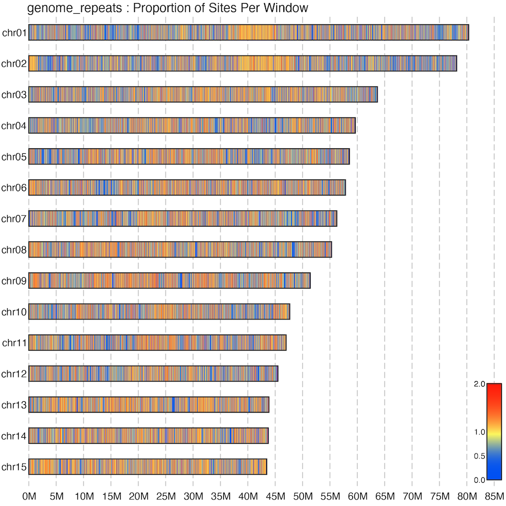

# Plot heatmaps of genome-wide stats

Plots heatmaps of the density of specified genomic elements along the chromosomes.

## Binning the elements in genomic windows

Before making the plots, we need to make a tally of the genomic elements of 
interest (e.g., genes, exons, repeats, etc.) along the genome. This script slices 
the genome down into windows of even lengths, which can be either overlapping or 
non-overlapping, and tallies both the number of the target element in each window, 
as well as the proportion of total basepairs covered by those elements. These are 
then used as inputs for the plotting script.

### Usage

```sh
$ python3 bin_genome_stats.py -h

  bin_genome_stats.py started on 2025-03-26 13:43:54.
  usage: bin_genome_stats.py [-h] -f FAI -b IN_BED [-n BASENAME] [-o OUT_DIR] 
                             [-s WIN_SIZE] [-t WIN_STEP] [-m MIN_LEN] [-p MIN_SPAN]
  
  options:
    -h, --help            show this help message and exit
    -f, --fai FAI         (str) Path to genome index in FAI format.
    -b, --in-bed IN_BED   (str) Path to input BED file describing the windows to be 
                          tallied.
    -n, --basename BASENAME
                          (str) Basename of output files [default=BED Basename].
    -o, --out-dir OUT_DIR
                          (str) Path to output directory [default=.].
    -s, --win-size WIN_SIZE
                          (int/float) Size of windows in bp [default 100,000].
    -t, --win-step WIN_STEP
                          (int/float) Step of windows in bp [default 50,000].
    -m, --min-len MIN_LEN
                          (int/float) Minimum chromosome size in bp [default 
                          1,000,000]
    -p, --min-span MIN_SPAN
                          (int/float) Minimum genomic span in bp required to keep an 
                          element from the input BED file [default=1].
```

### Inputs

Genome FASTA index, as generated by `samtools faidx <genome.fa>` 
([docs](http://www.htslib.org/doc/samtools-faidx.html)).

```sh
chr01   73382502   7           60   61
chr02   65036697   74605558    60   61
chr03   63127771   140726207   60   61
chr06   60469010   204906115   60   61
chr04   56595772   266382949   60   61
chr08   56204502   323921991   60   61
chr07   56023676   381063242   60   61
chr05   55627136   438020653   60   61
chr09   55004135   494574915   60   61
chr10   53367998   550495793   60   61
```

The span of the regions of interest in BED 
[format](https://genome.ucsc.edu/FAQ/FAQformat.html).

```
chr01   53100   53391
chr01   60254   60418
chr01   63590   63767
chr01   70591   70702
chr01   73652   73765
chr01   74530   74921
chr01   85623   87679
chr01   88104   88308
chr01   95152   95296
chr01   95709   95866
```

Note that only the first three columns are required (`chrom`, `chromStart`, and `chromEnd`), 
following the BED specification. The additional columns can contain additional information, 
but they are not used by the software. If the objective is to generate the window statistics 
for different genetic elements (e.g., genes vs repeat elements), the software must be run 
separately.

For example, a BED file of the location of annotated genes can be extracted from a GFF/GTF 
file using the following command:

```sh
$ cat genome.gff | \
    awk '$3 == "gene" {print $1, $4-1, $5}' | \
    tr ' ' '\t' > genes.bed
```

### Example

```sh
python3 bin_genome_stats.py \
    --fai ./genome.fa.fai \     # Path to genome FAI
    --in-bed ./genes.bed \      # Path to input BED
    --basename genome_genes \   # Basename of output files
    --out-dir ./output \        # Path to output directory
    --min-len 1000000 \         # Calulate for scaffolds larger than 1 Mbp
    --win-size 100000 \         # Average over 100 Kbp windows
    --win-step 50000 \          # Calculate windows every 50 Kbp
    --min-span 10               # Include only input elements larger than 10 bp
```

Here, we will calculate the windowed average of the density of annotated protein-coding 
genes in a target genome. We used the BED file generated above to specify the location of 
these genes using the `--in-bed` option. We specify the size and number of chromosomes by 
providing a genome index in FAI format (`--fai`). We want our output files to be saved to 
a specific directory (`--out-dir`), using a provided basename (`--basename`) to name the 
generated files.

We also provide other option describing the length and distribution of the windows. First,
we want to calculate results only for input sequences larger than 1 Mbp (`--min-len`). The 
windows will be 100 Kbp in length (`--win-size`), and we will calculate windows every 50 
Kbp (`--win-step`). Since the step of the windows is smaller than the window size, adjacent 
windows will have some amount of overlaping sites. Setting the step of windows equal to 
their size will result in non-overlapping windows. Lastly, will filter out the input BED,
skipping over any input intervals smaller than 10 bp (`--min-span`).

### Output

After running with the example above, the script will generate an output labelled 
`genome_genes.binned_genome_stats.tsv` with the following structure:

```sh
#Chrom  StartBP  EndBP   MidBP   ElementsN  ElementsAdj  PropSites  PropSitesAdj
chr01   0        100000  50000   0          0            0          0
chr01   50000    150000  100000  0          0            0          0
chr01   100000   200000  150000  0          0            0          0
chr01   150000   250000  200000  0          0            0          0
chr01   200000   300000  250000  1          0.87719298   0.07352    0.46886998
chr01   250000   350000  300000  1          0.87719298   0.07352    0.46886998
chr01   300000   400000  350000  0          0            0          0
chr01   350000   450000  400000  2          1.754386     0.52817    3.3683767
chr01   400000   500000  450000  1          0.87719298   0.72612    4.6307925
```

Info on columns:

| Column Header   | Explanation |
| --------------- | ----------- |
| `Chrom`         | Name of the chromosome/scaffold sequence. |
| `StartBP`       | Start coordinate of the window in basepairs. |
| `EndBP`         | End coordinate of the window in basepairs. |
| `MidBP`         | Midpoint coordinate of the window in basepairs. |
| `ElementsN`     | Number of elements seen in the window. |
| `ElementsAdj`<sup>1</sup> | Adjusted number of elements in the window, according to the genome-wide average. |
| `PropSites`<sup>2</sup> | Proportion of sites in the window corresponding to the target elements. Sites belonging to overlapping elements are counted once. |
| `PropSitesAdj`<sup>1</sup> | Adjusted Proportion of sites in the window corresponding to the target elements, according to the genome-wide average. |

<sup>1</sup>For standardization purposes, the adjusted values 
correspond to the value of the window divided by the genome-wide mean, i.e., the 
`ElementsAdj` describes the number of elements of interest observed in a window,
scaled by the genome-wide average. Values greater than 1 describe sites with 
higher than average values, while values smaller than 1 describe window with smaller 
than average values. For example, a `ElementsAdj` of 2 indicates that the given 
window contains twice as elements than the genome-wide average.

<sup>2</sup>The `PropSites` column describes the proportion of sites in a window 
corresponding to the elements of interest. In other words, if in the span of a 
100 Kbp window, 30 Kbp of those sites are in the span of an element of interest 
(e.g., genes), then the window will have a `PropSites` value of 0.3. Similar to 
`ElementsAdj`, this value is then scaled by the genome-wide average in `PropSitesAdj`.

### Dependencies

* Python > 3.8
* [NumPy](https://numpy.org/)

## Making the plots

With the average of the number and proportion of total elements calculated along 
windows in the genome, we can proceed with plotting them as a heatmap. The resulting 
plot shows the density of the elements of interest along the genome.

### Usage

```sh
$ python3 cairo_plot_genome_stats.py -h

  cairo_plot_genome_stats.py started on 2025-03-27 14:53:21.
  usage: cairo_plot_genome_stats.py [-h] -f FAI -t IN_TABLE [-c CHROMS]
                                    [-o OUT_DIR] [-n BASENAME] [-m MIN_LEN]
                                    [-s SCALE] [-p STEP]
                                    [--img-height IMG_HEIGHT]
                                    [--img-width IMG_WIDTH]
                                    [--img-format IMG_FORMAT]

  options:
    -h, --help            show this help message and exit
    -f, --fai FAI         (str) Path to genome index in FAI format.
    -t, --in-table IN_TABLE
                          (str) Path to input table of window statistics,
                          generated by `bin_genome_stats.py`.
    -c, --chroms CHROMS   (str) Path to chromosome order list [default=None].
    -o, --out-dir OUT_DIR
                          (str) Path to output directory [default=.].
    -n, --basename BASENAME
                          (str) Basename of output files [default=In table
                          basename].
    -m, --min-len MIN_LEN
                          (int/float) Minimum chromosome size in bp [default
                          1,000,000]
    -s, --scale SCALE     (int/float) Scale chromosome lengths to this value
                          [default=1,000,000],
    -p, --step STEP       (int/float) Steps for size for axis tick marks
                          [default=5,000,000].
    --img-height IMG_HEIGHT
                          (int) Image height in pixels [default=500].
    --img-width IMG_WIDTH
                          (int) Image width in pixels [default=500].
    --img-format IMG_FORMAT
                          (str) Image output format [default=pdf]
```

### Inputs

Genome FASTA index (see example above). This specifies the length and 
ID of the sequences to be plotted. Sequences below a certain length 
threshold can be filtered using the `--min-len` option.

A `*.binned_genome_stats.tsv` table, generated by the `bin_genome_stats.py` 
script (see example above).

Optionally, a chromosome order file can be provided. This file specifies the 
order in which the chromosomes are plotted, if different from the FAI. The file 
contains the chromosome IDs (one per line) in the order they will be plotted 
(first sequence in the file will be plotted at the top).

```sh
chr01
chr02
chr03
chr06
chr04
chr08
...
```

### Example

```sh
python3 cairo_plot_genome_stats.py \
    --fai ./genome.fa.fai \           # Path to genome FAI
    --in-table ./genome_genes.binned_genome_stats.tsv # Path to input table
    --basename genome_genes \         # Basename of output files
    --out-dir ./output \              # Path to output directory
    --min-len 1000000 \               # Plot scaffolds larger than 1 Mbp
    --step 5000000 \                  # Use a 5 Mbp step for the axis tick marks
    --chroms ./chrom_list.txt         # Path to the chromosome list file
```

Here, we make a heatmap of the density of protein-coding genes in the target genome, 
based on the distribution provided by the `genome_genes.binned_genome_stats.tsv` file 
(`--in-table`). We specify the size and number of chromosomes by providing a genome 
index in FAI format (`--fai`). We also provide a file describing a specific order for 
plotting the chromosomes (`--chroms`). We want our output files to be saved to 
a specific directory (`--out-dir`), using a provided basename (`--basename`) to name 
the two output plots. Lastly, we specify that we only want to plot sequences larger than 
1 Mbp (`--min-len`), and using a 5 Mbp step for the axis tick marks (`--step`).

### Outputs

The script generates two plots:

| Plot | Description |
| ---- | ----------- |
| `<basename>.num_elements.pdf` | Plot of the number of elements in each window, as specified by the `ElementsAdj` column in the input table. |
| `<basename>.site_proportions.pdf` | Plot of the proportion of target bases in each window, as specified by the `PropSitesAdj` in the input table. |


### Dependencies

* Python > 3.8
* [PyCairo](https://pycairo.readthedocs.io/en/latest/)
* [NumPy](https://numpy.org/)

## Some examples

Here's an example of the distribution of repeat elements along a genome, 
using 100 Kbp windows with a step of 50 Kbp. More specifically, this plot 
shows the distribution of repeat sites in those 100 Kbp windows, adjusted 
to the genome-wide average. Areas in orange-red show a higher than average 
density of repeats.



### Published examples

Figure 2B and 2C ([link](https://academic.oup.com/view-large/figure/397327756/msad029f3.tif)) 
from [Rivera-Colon et al. 2023](https://doi.org/10.1093/molbev/msad029).

Figure 3 ([link](https://academic.oup.com/view-large/figure/499727840/jkae267f3.jpg)) 
from [Rayamajhi et al. 2024](https://doi.org/10.1093/g3journal/jkae267).

## Author

Angel G. Rivera-Colon  
Institute of Ecology and Evolution  
University of Oregon
